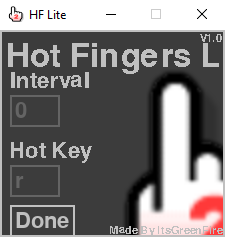
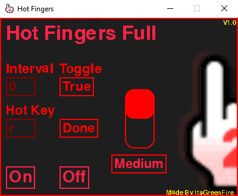

# Hot Fingers Lite

 Created by ItsGreenFire

###### Hot Fingers Lite Preview

###### Hot Fingers Full Preview

## Instructions

### Installation
<ol style="color: gold">
    <li>Click "Code" > "Download Zip"</li>
    <li>Unzip the zipped folder. You will now have a normal HotFingers-master folder</li>
    <li>Delete the DELETEME directory and *optional* delete "README.md". Do not delete anything else!</li>
    <li>Run main.exe</li>
</ol>

### Hot Fingers Lite

    The interval button can be used to set an interval between each click. Click and type a number to use (Decimals are supported)
     
    Setting the hotkey button will change what key activates the auto clicker. Click and type to use (Some characters cause crashes and mouse buttons are not yet working)
     
    Always click the done button after changing settings. The color of the interval and hotkey buttons will change to dark red.

### Hot Fingers Full

    *Ditto Hot Fingers Lite instructions*
     
    The toggle/hold button allows you to either toggle on the auto clicker with the hotkey, or have to hold the hotkey down while you want the auto clicker activated.
     
    Setting the power will change the speed at which the auto clicker clicks. There are three settings: "Slow", "Medium", "Fast".
    WARNING : Due to high CPU usage on "Fast", some games have a chance at crashing. Recommended for strong CPUs only.

## How Do I Get Hot Fingers Full?

Hot Fingers Full is currently only available to friends. Eventually there will be a free method of getting it

## ToS
<ol style="color: gold;">
    <li>All credit must be given to ItsGreenFire. </li>  
    <li>You may not make profit off of this. </li>
    <li>If uploaded at another source, it must be free to use. </li>
    <li>Any rules broken with this program cannot go against the creator as it was the user's choice.</li>
</ol>